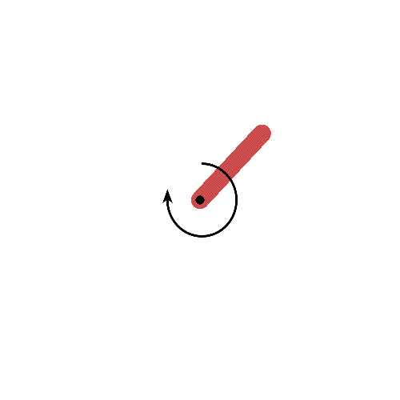
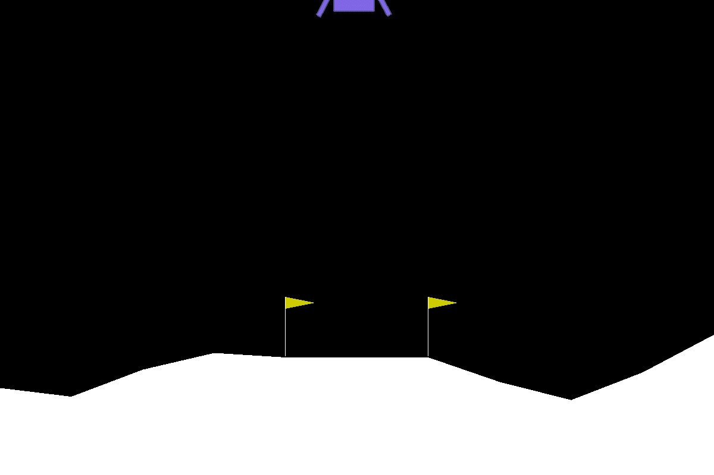

# dragonfly

Dragonfly is a buffer-based DRL research code. It follows a basic level of modularity to make new developments quick and easy. Below are a few environment solved with the library.

| Environment | Description | Illustration |
| :--- | :--- | :---: |
| `CartPole-v0` | The basic `gym` environment, solved with PPO. The agent learns to balance a pole fixed to a moving cart, using discrete lateral movements of the cart. See additional details <a href="dragonfly/save/cartpole/README.md">here</a>. |  |
| `Pendulum-v0` | The basic `gym` environment, solved with PPO. The agent learns to balance a 1-bar pendulum vertically, using limited torque force. See additional details <a href="dragonfly/save/pendulum/README.md">here</a>.  |  |
| `lorenz-stabilizer-discrete-v0` | A custom environment for the control of the chaotic Lorenz attractor with discrete actions, solved with PPO. The agent lears to **minimize** the number sign changes of the `x` coordinate. See additional details <a href="dragonfly/save/lorenz_stabilizer/README.md">here</a>. |  |
| `LunarLander-v2` | The basic `gym` environment, solved with PPO. The agent learns to land on a landing pad using 4 discrete actions. See additional details <a href="dragonfly/save/lunarlander/README.md">here</a>. |  |
