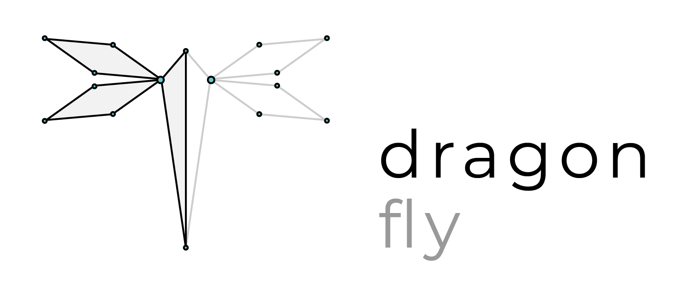
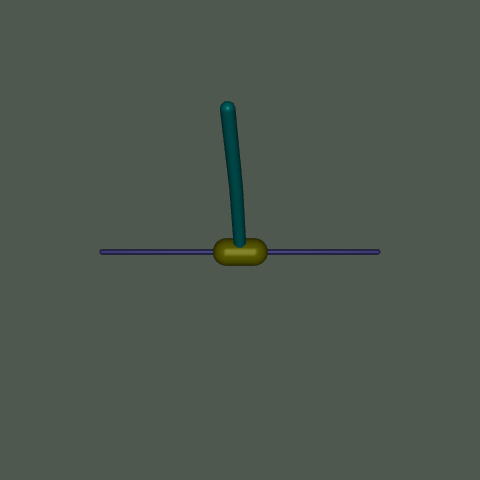
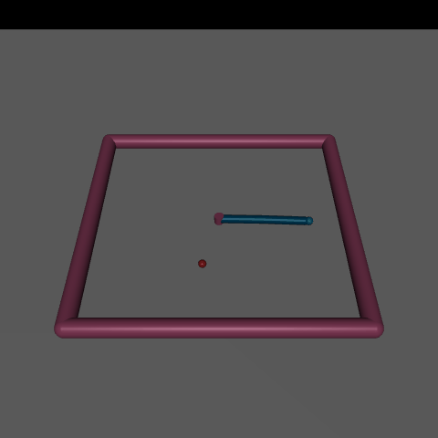
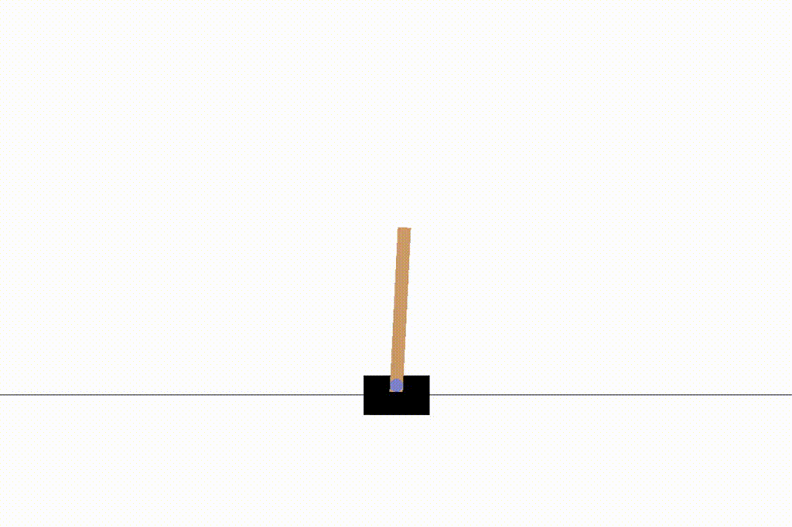
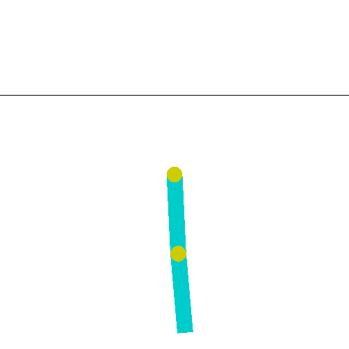
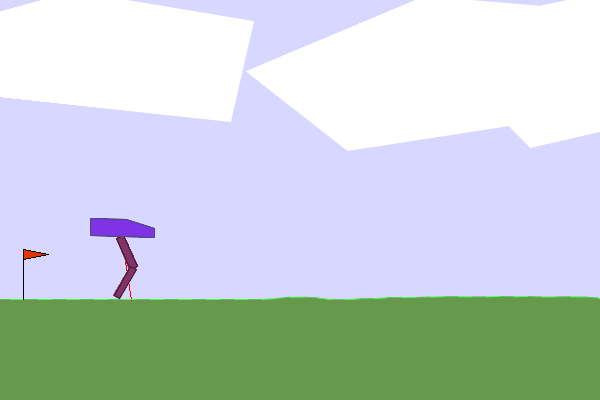
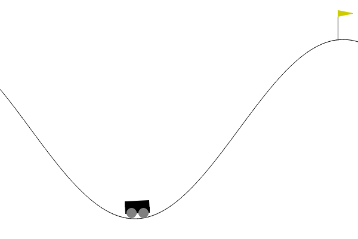

# dragonfly

<p align="center">
  
</p>


`dragonfly` is a small library for DRL. It follows a basic level of modularity based on a simple abstract factory to make new developments quick and easy.

## Installation and usage

Clone this repository and install it locally:

```
git clone git@github.com:jviquerat/dragonfly.git
cd dragonfly
pip install -e .
```

Environments are expected to be available locally or present in the path. To train an agent on an environment, a `.json` case file is required (sample files are available for standard `gym` envs in `dragonfly/env`). Once you have written the corresponding `<env_name>.json` file to configure your agent, just run:

```
dgf --train <json_file>
```

To evaluate a trained agent, you will need a trained agent saved with `tf` format, as well as a `.json` case file. Then, just run:

``` 
dgf --eval -net <net_file> -json <json_file>
```

In that case, the environment will just rely on the `done` signal to stop the evaluation. Alternatively, you can provide a `-steps <n>` option, that will override the `done` signal of the environment, and force its execution for `n` steps. Trained agents for standard `gym` environements are available in `dragonfly/env`.

## CFD environments

| Environment | Description | Illustration |
| :--- | :--- | :---: |
| `turek-v0` | A drag reduction problem exploiting two synthetic jets on a cylinder immersed in a flow at Re=100. See additional details <a href="dragonfly/env/turek/README.md">here</a>. |  |

## Mujoco environments

| Environment | Description | Illustration |
| :--- | :--- | :---: |
| `Hopper-v4` | A one-legged humanoid learns to move forward by hopping. See additional details <a href="dragonfly/env/hopper/README.md">here</a>. |  |
| `InvertedDoublePendulum-v4` | A double inverted pendulum to be balanced by the agent. See additional details <a href="dragonfly/env/inverteddoublependulum/README.md">here</a>. |  |
| `Reacher-v4` | An articulated arm must reach a randomly-positionned ball with minimal effort from its two actuators. See additional details <a href="dragonfly/env/reacher/README.md">here</a>. |  |

## Gym environments

Below are a few environment solved with the library.

| Environment | Description | Illustration |
| :--- | :--- | :---: |
| `CartPole-v0` | The basic `gym` environment. The agent learns to balance a pole fixed to a moving cart, using discrete lateral movements of the cart. See additional details <a href="dragonfly/env/cartpole/README.md">here</a>. |  |
| `Pendulum-v0` | The basic `gym` environment. The agent learns to balance a 1-bar pendulum vertically, using limited torque force. See additional details <a href="dragonfly/env/pendulum/README.md">here</a>.  |  |
| `Acrobot-v1` | The basic `gym` environment. The agent learns to swing a two-links system up to a certain height. See additional details <a href="dragonfly/env/acrobot/README.md">here</a>.  | 
| `LunarLanderContinuous-v2` | The basic `gym` environment. The agent learns to land on a landing pad using 4 continuous actions. See additional details <a href="dragonfly/env/lunarlandercontinuous/README.md">here</a>. |  |
| `BipedalWalker-v3` | The basic `gym` environment. The agent learns to walk with a bipedal "thing" by applying torque to 4 different joints. See additional details <a href="dragonfly/env/bipedalwalker/README.md">here</a>. |  |
| `MountainCar-v0` | The basic `gym` environment. The agent learns run a car from the bottom of a valley to the top of a hill. See additional details <a href="dragonfly/env/mountaincar/README.md">here</a>. |  |
