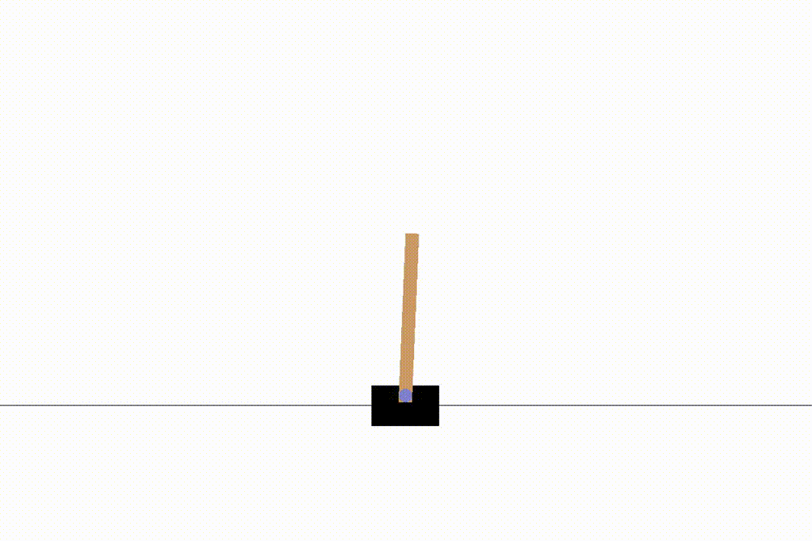
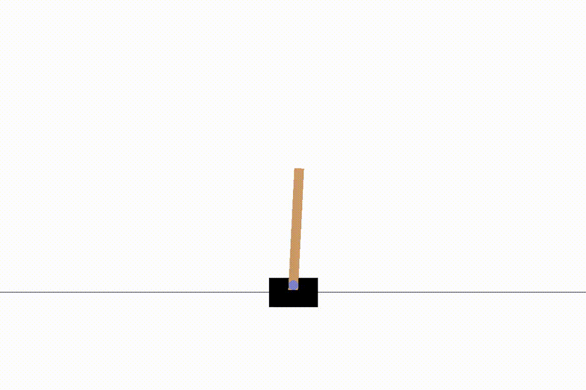
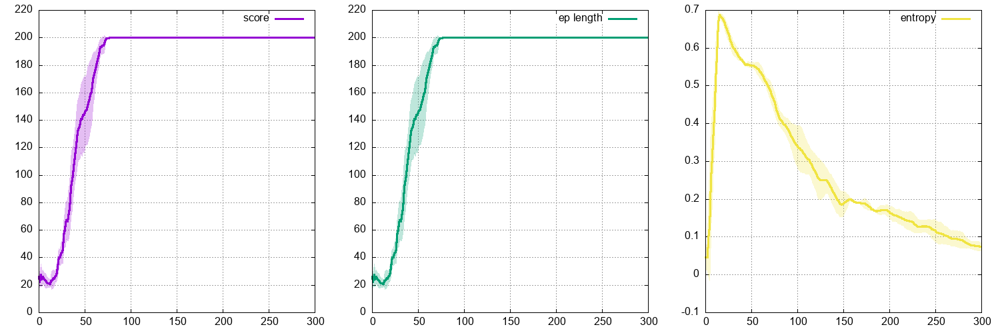

# dragonfly

Dragonfly is a buffer-based DRL research code. It follows a basic level of modularity to make new developments quick and easy. Below are a few tests made on several `gym` environments, using discrete and continuous PPO:

## `cartpole-v0` (discrete)

The agent learns to balance a pole fixed to a moving cart, using discrete lateral movements of the cart.

  
  

  

## `pendulum-v0` (continuous)

The agent learns to balance a 1-bar pendulum vertically, using limited torque force.

  
  

  

## `lunarlander-v2` (discrete)

The agent learns to land on a landing pad using 4 discrete actions.

  
  

  

