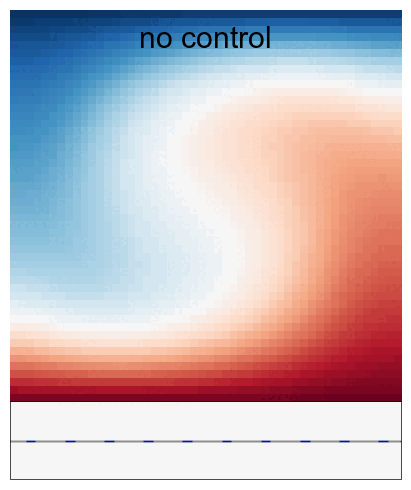

# dragonfly

<p align="center">
  
</p>


`dragonfly` is a small library for DRL. It follows a basic level of modularity based on a simple abstract factory to make new developments quick and easy.

## Installation and usage

Clone this repository and install it locally:

```
git clone git@github.com:jviquerat/dragonfly.git
cd dragonfly
pip install -e .
```

Environments are expected to be available locally or present in the path. To train an agent on an environment, a `.json` case file is required (sample files are available for standard `gym` envs in `dragonfly/env`). Once you have written the corresponding `<env_name>.json` file to configure your agent, just run:

```
dgf --train <json_file>
```

To evaluate a trained agent, you will need a trained agent saved with `tf` format, as well as a `.json` case file. Then, just run:

```
dgf --eval -net <net_file> -json <json_file> -steps <n_steps_control> -warmup <n_steps_warmup> <warmup_control_value>
```

In that case, the environment will just rely on the `done` signal to stop the evaluation. Alternatively, you can provide a `-steps <n>` option, that will override the `done` signal of the environment, and force its execution for `n` steps. Trained agents for standard `gym` environements are available in `dragonfly/env`.

## Running benchmarks

It is possible to run many json files at once using the scripts in `env/benchmarks/`. You can either run directly `bench_folder.sh <folder_name>`, or submit it on a cluster using `sbatch job.sh "<folder_name>"`.

## CFD environments

| Environment   | Description                                                                                        | Illustration                                                 |
|:--------------|:---------------------------------------------------------------------------------------------------|:------------------------------------------------------------:|
| `turek-v0`    | A drag reduction problem exploiting two synthetic jets on a cylinder immersed in a flow at Re=100. |     |
| `shkadov-v0`  | A control problem with multiple jets trying to damp instabilities on a falling liquid film.        |   |
| `rayleigh-v0` | A control problem with local temperature control to kill a convection cell at Ra=1e4.              |  |
| `mixing-v0`   | A problem where the agent must mix a scalar quantity by controlling the boundary velocities.       |    |

## Mujoco environments

| **`Hopper-v4`**                                                  | **`Ant-v4`**                                                  | **`Swimmer-v4`**                                             |
|:----------------------------------------------------------------:|:-------------------------------------------------------------:|:------------------------------------------------------------:|
|       |       |  |
| **`HalfCheetah-v4`**                                             | **`Walker2d-v4`**                                             | **`Humanoid-v4`**                                            |
|  |  |     |

## Gym environments

| **`Cartpole-v0`**                                                          | **`Pendulum-v0`**                                                  | **`Acrobot-v1`**                                                 |
|:--------------------------------------------------------------------------:|:------------------------------------------------------------------:|:----------------------------------------------------------------:|
|               |       |      |
| **`LunarLanderContinuous-v2`**                                             | **`BipedalWalker-v3`**                                             | **`MountainCar-v0`**                                             |
|  |  |  |
