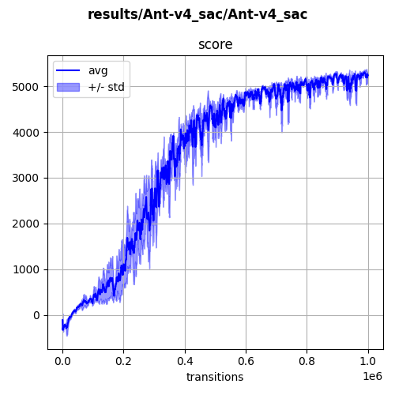

## `ant-v4` (continuous)

A quadrupedal ant learning to walk. Here we observe some sort of "cheating", as the ant mostly uses the two lateral legs. Score is approximatively 5200.

  

Using SAC:

  

