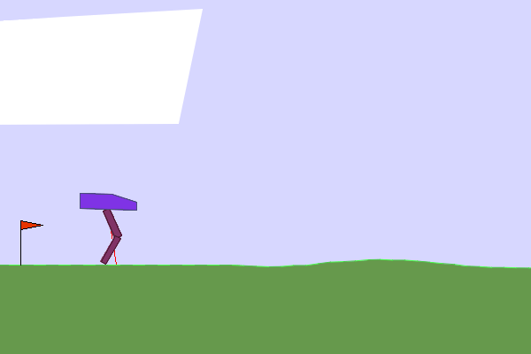

## `bipedalwalker-v3` (continuous)

The agent learns to walk with a bipedal "thing" by applying torque to 4 different joints, the goal being to walk to the end of the path.

  
  

Resolution with PPO and TD3:

  
  

