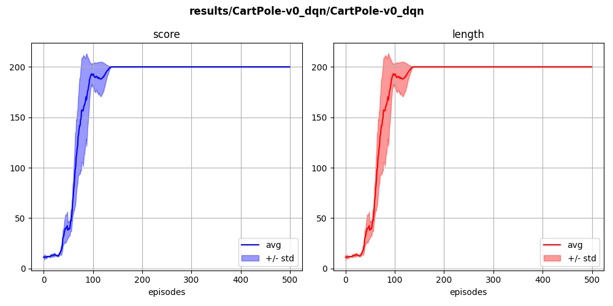
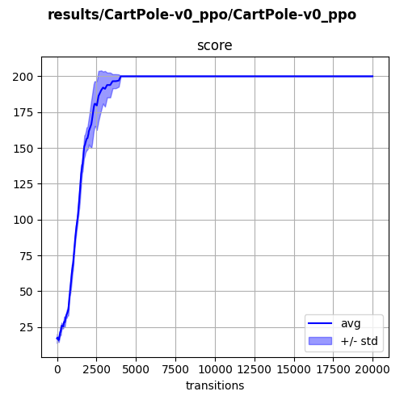
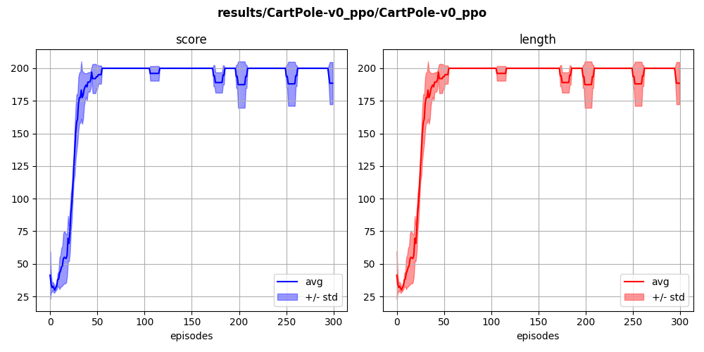

## `cartpole-v0` (discrete)

The agent learns to balance a pole fixed to a moving cart, using lateral movements of the cart.

  
  

Below are resolutions with DQN, PPO (buffer-based) and PPO (episode-based):

  
  
  

