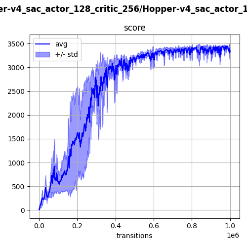

## `hopper-v4` (continuous)

A weird one-legged humanoid learns to move forward using three joint torques. The right run is obtained with the SAC algorithm after 1,000,000 transitions, with a score of 3578.

  
  

Resolution with PPO, TD3 and SAC:

  
  
  

