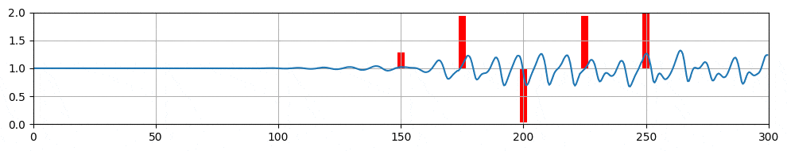

## `shkadov-v0` (continuous)

In this environment, the agent actuates several jets to damp the instabilities of a falling fluid film (original approach was from Belus et al. in <a href="https://aip.scitation.org/doi/10.1063/1.5132378">this paper</a>.) States are the height and mass flow rate upstream of each jet. One episode represents 400 actions, and the training is made on 500000 transitions for 5 jets (approx. 30 mins on a laptop). A score average is obtained on 3 different runs:

  

The resulting control is shown below:

  

