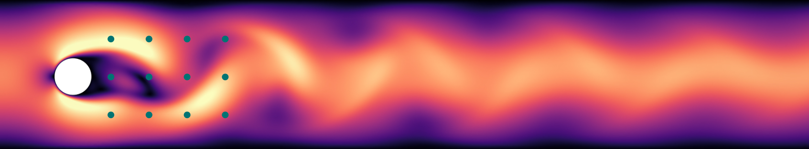
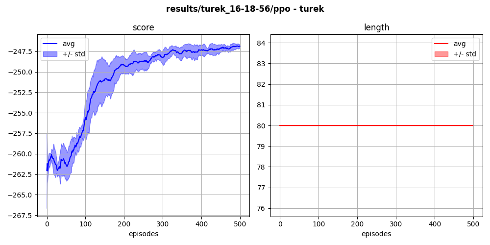

## `turek-v0` (continuous)

In this environment, the agent actuates two synthetic jets orthogonal to the flow, in order to reduce the drag exerted on the cylinder (original approach was from Rabault et al. in <a href="https://arxiv.org/pdf/1808.10754.pdf">this paper</a>.) States are the pressure collected at several points in the flow:

  

One episode represents 80 actions, and the training is made on 500 episodes, requiring approximatively 7 hours of CPU time. A score average is obtained on 5 different runs:

  

The resulting control decreases the drag by approximately 8%:

  

