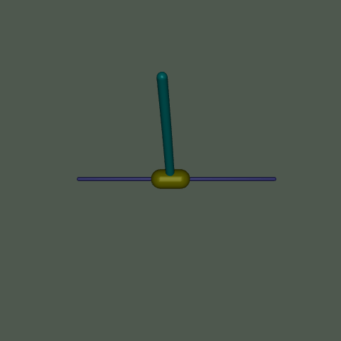
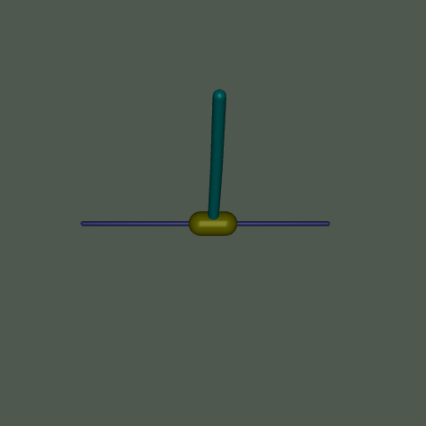
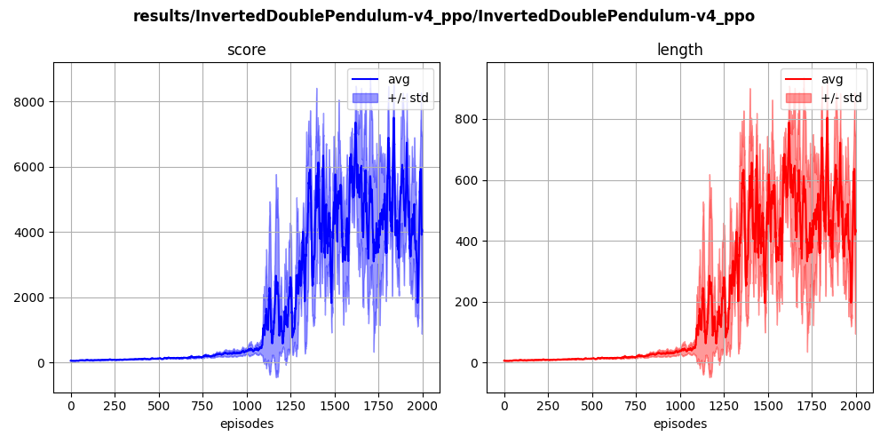

## `inverteddoublependulum-v4` (continuous)

The agent must learn to balance a double inverted pendulum with an intermediate joint. This results are still highly suboptimal.

  
  

Using PPO:

  

