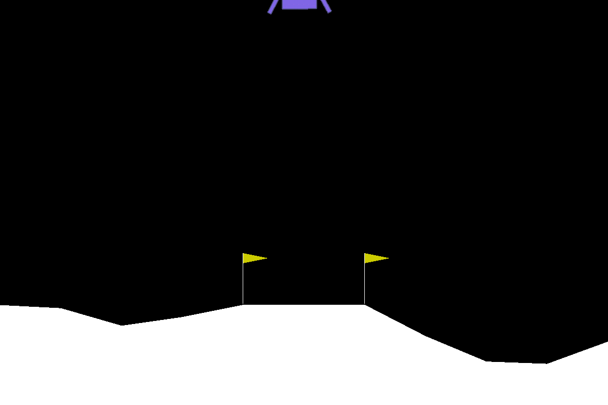
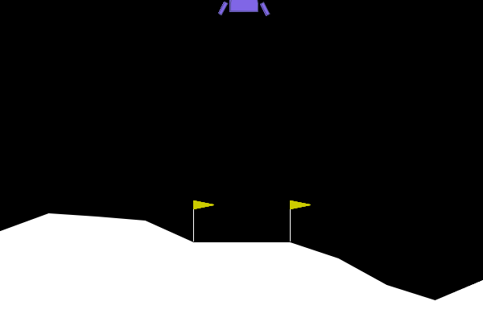
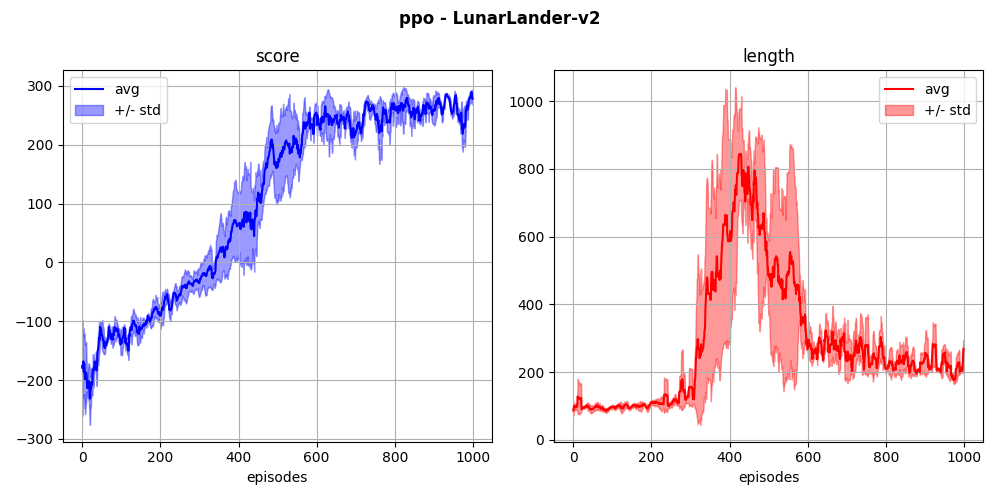
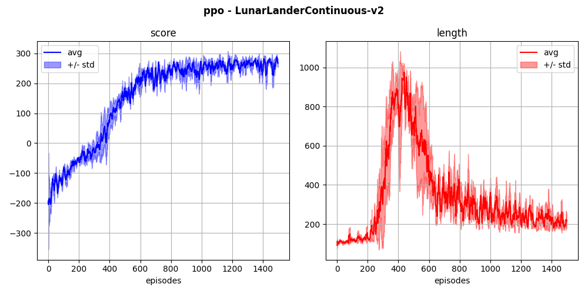

## `lunarlander-v2` (discrete)

The agent learns to land on a landing pad using 4 discrete actions.

  
  

Here is a resolution of the discrete environment with PPO, using buffer-based training:

  

Below is a resolution of the continuous environment, also with PPO:

  

