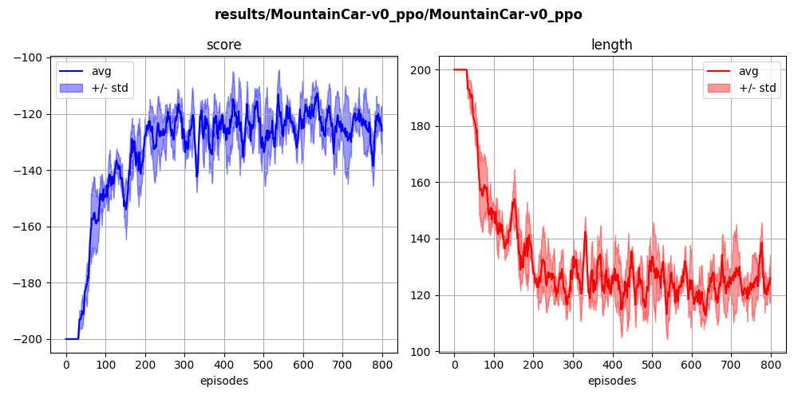

## `mountaincar-v0` (discrete)

The agent learns to run a car from the bottom of a valley to the top of a hill. This problem has sparse reward (i.e. it is 0 everywhere, except when the cart reaches the final goal).

  
  

Here is a resolution with buffer-based ppo:

  

