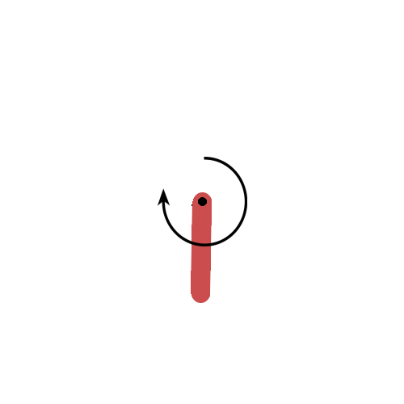
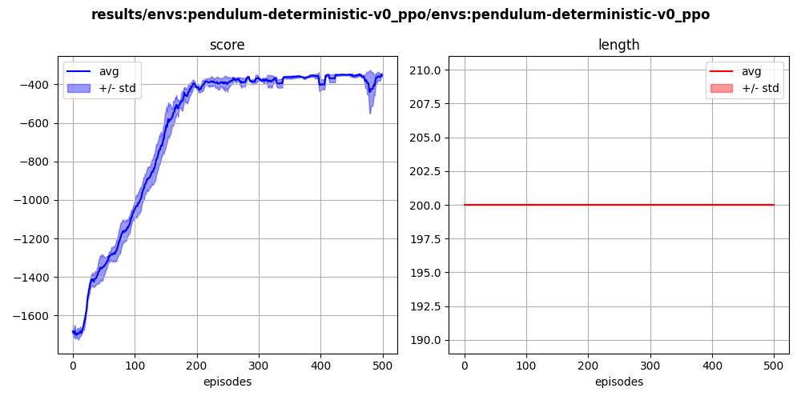

## `pendulum-deterministic-v0` (continuous)

This is a deterministic version of the standard `gym` environment, with no initial variability. The initial state is with the pendulum down with zero angular velocity. The best score is approximately -340, and as for the regular pendulum case, re-using previous samples helps a lot.

  

  

