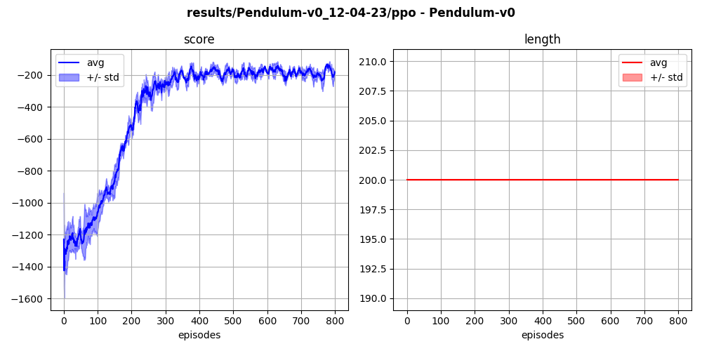
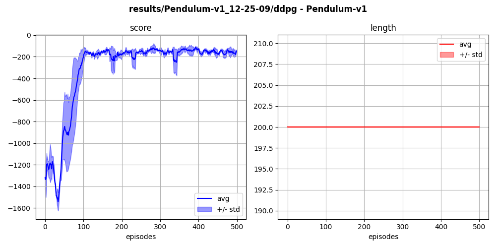
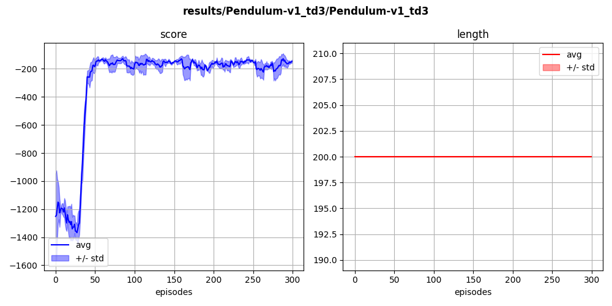

## `pendulum-v0` (continuous)

The agent learns to balance a 1-bar pendulum vertically, using limited torque force.

  
  

Solved with PPO:

  

Yet, PPO is significantly outperformed by offline algorithms such as DDPG (top) and TD3 (bottom):

  

  

