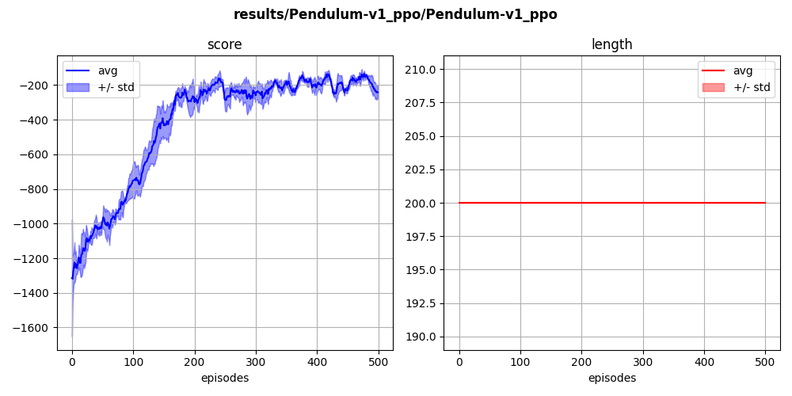

## `pendulum-v0` (continuous)

The agent learns to balance a 1-bar pendulum vertically, using limited torque force.

  
  

In this environment, we noticed that re-using previous buffers significantly reduces the variability during the learning process.

  

