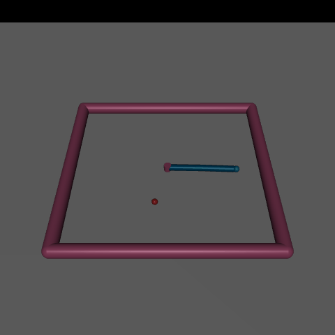
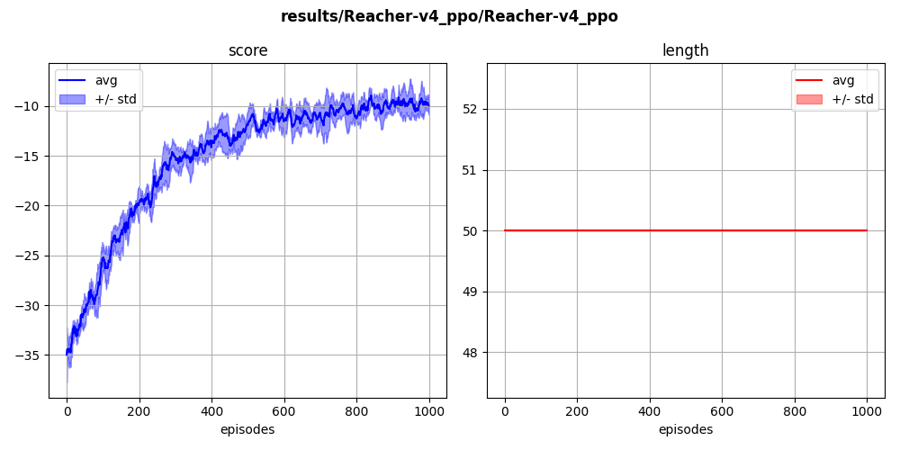

## `reacher-v4` (continuous)

A robotic arm learns to reach a randomly-positionned ball using two actuators. The goal is to go as close as possible to the ball while using minimal actuations.

  

Using PPO:

  

