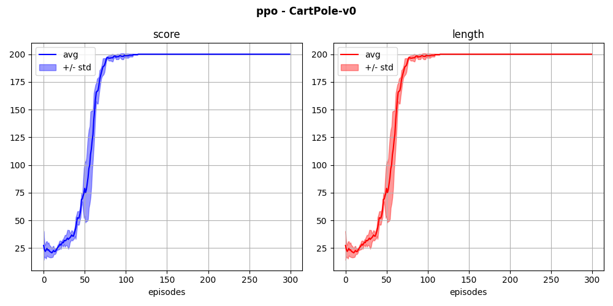
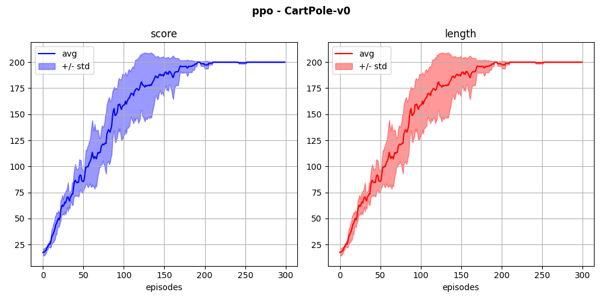
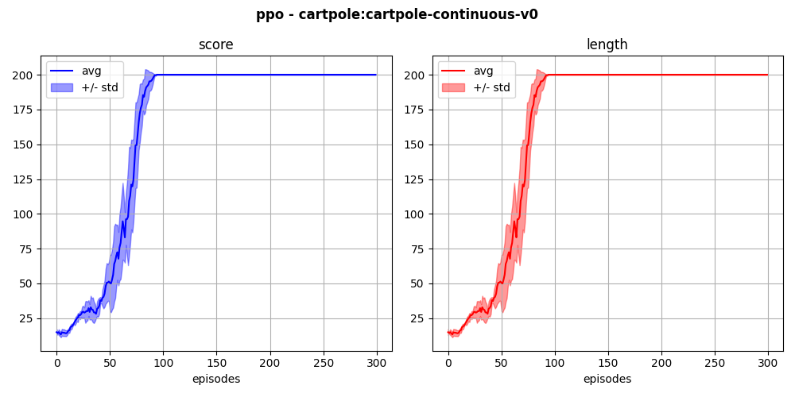

## `cartpole-v0` (discrete)

The agent learns to balance a pole fixed to a moving cart, using discrete lateral movements of the cart.

  
  

Here is a resolution with PPO, using buffer-based training:

  

and using episode-based training:

  

Below is a resolution of a continuous version of the cartpole environment, using buffer-based PPO:

  

