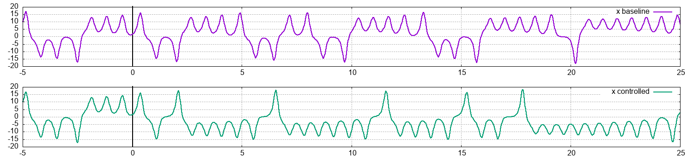
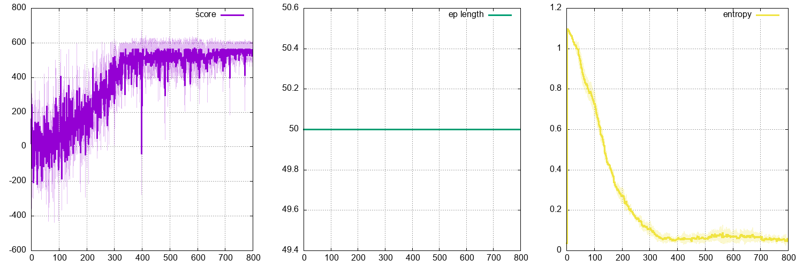

## ```lorenz-stabilizer-discrete-v0```

The second environment aims at minimizing the number of sign changes of the `x` component. Reward is consistently 1 for each step with negative x, and consistently -1 for each step with positive x (hence this is a dense reward environment). The control-less environments has a reward of -356, while the current controlled example has a cumulated reward of 620. You can find more about this environment on <a href="https://github.com/jviquerat/custom_gym_envs">this repository</a>.

<p align="center">
  
</p>

<p align="center">
  
</p>

<p align="center">
  
</p>
